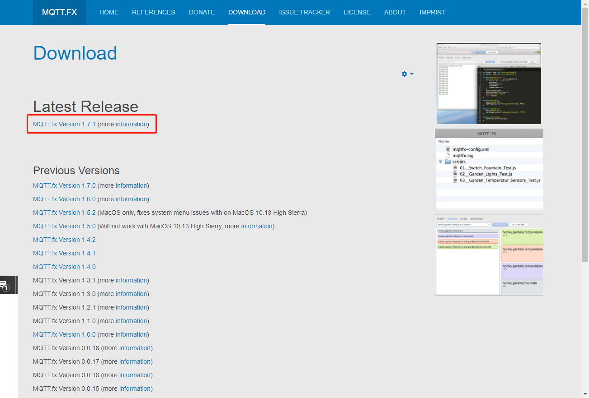
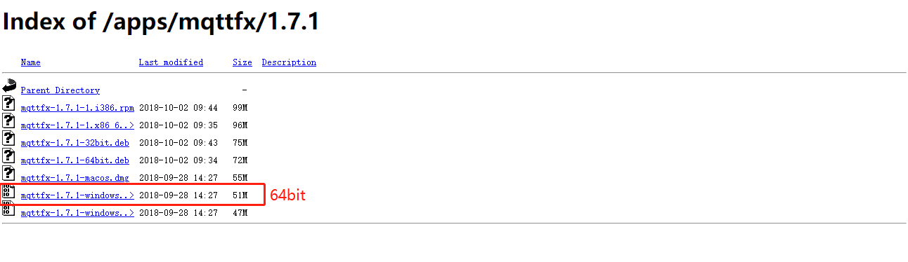
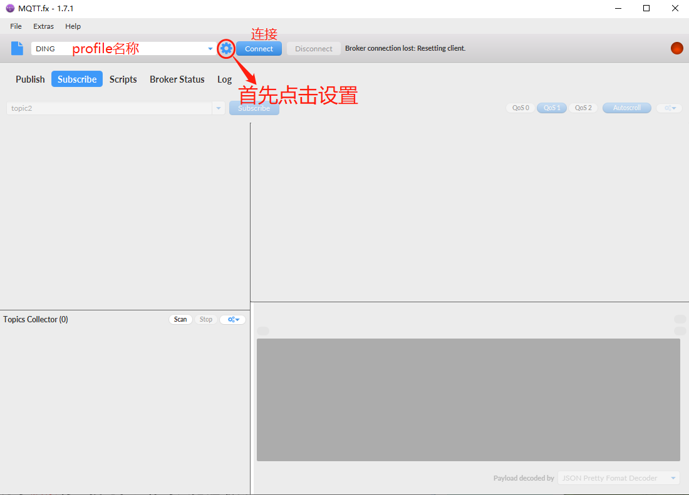
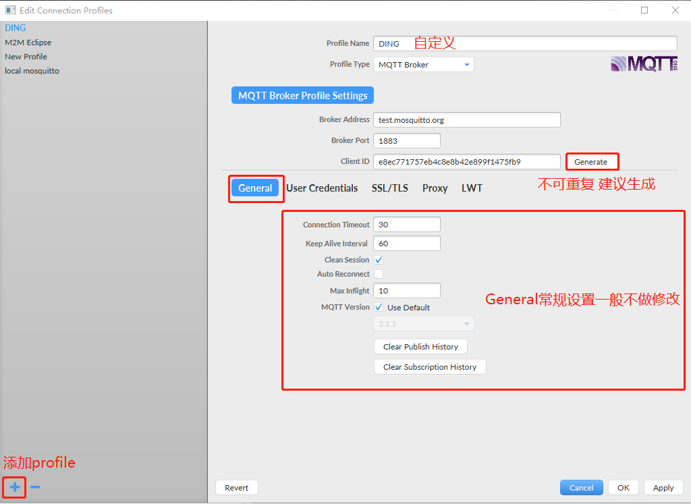
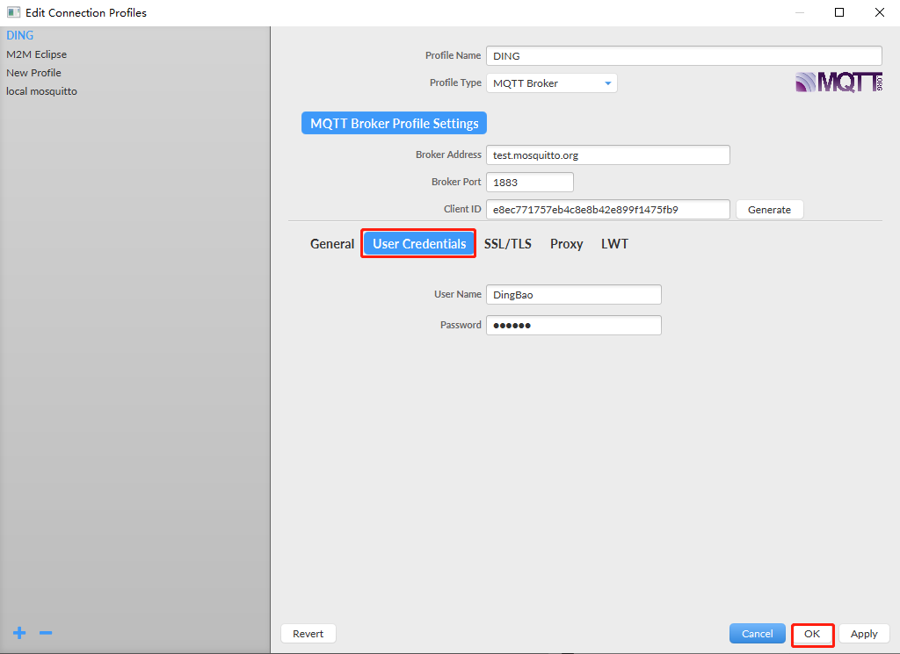
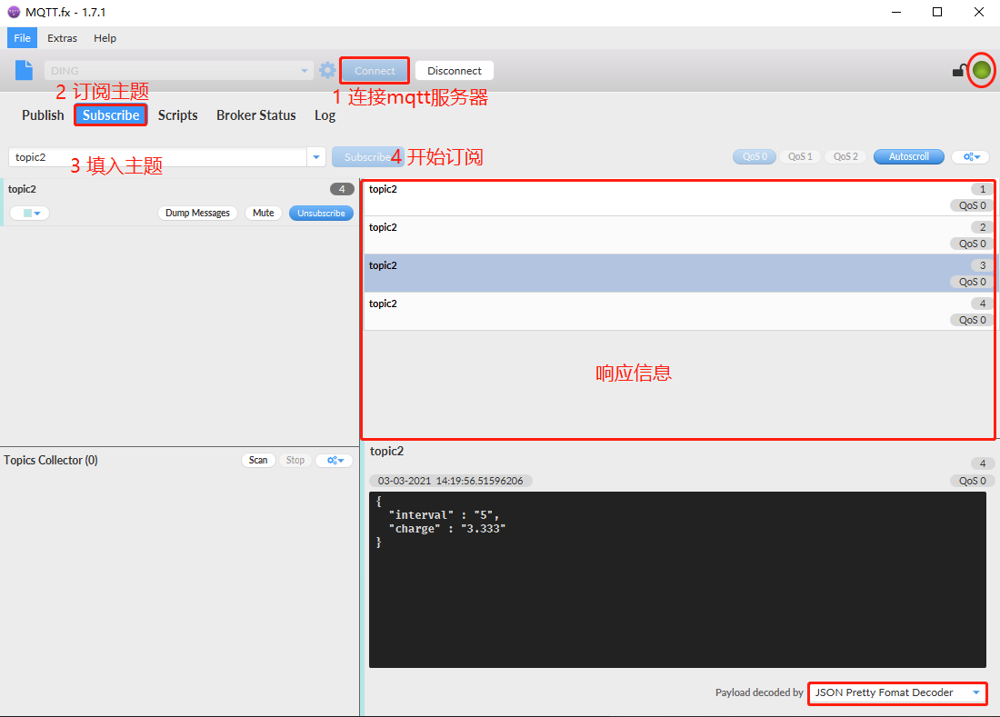
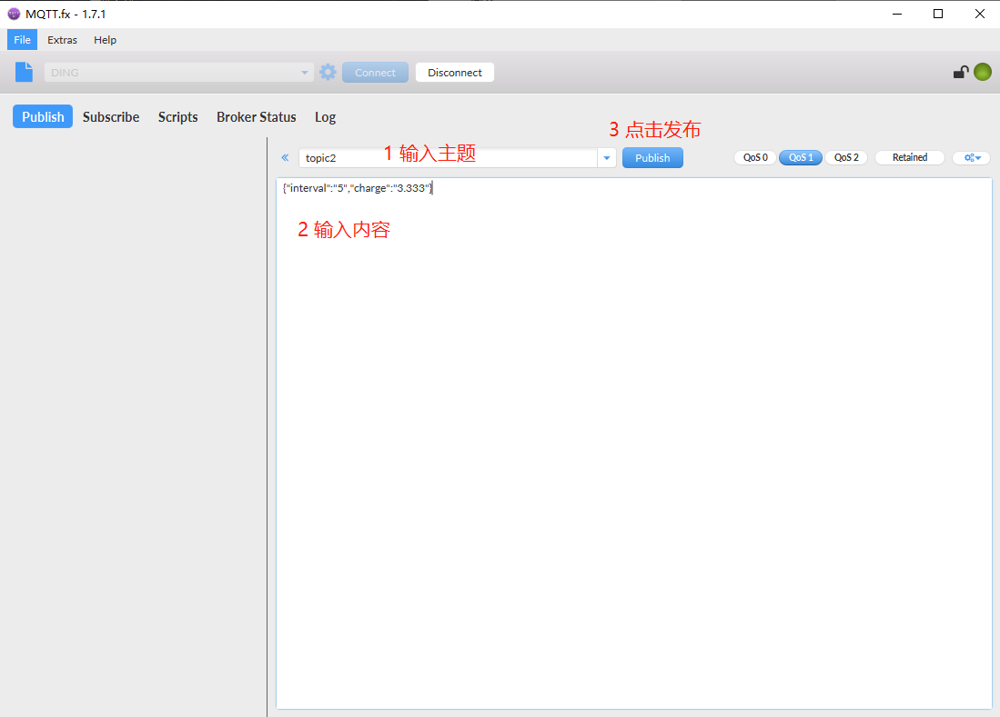
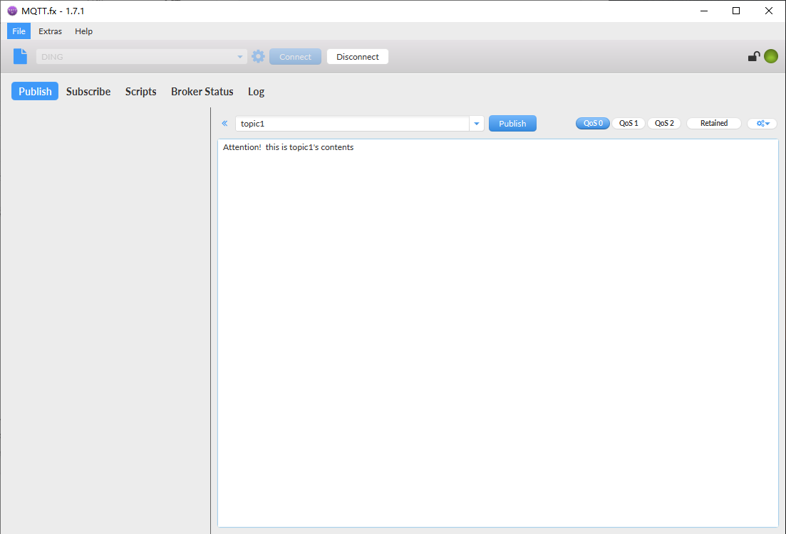
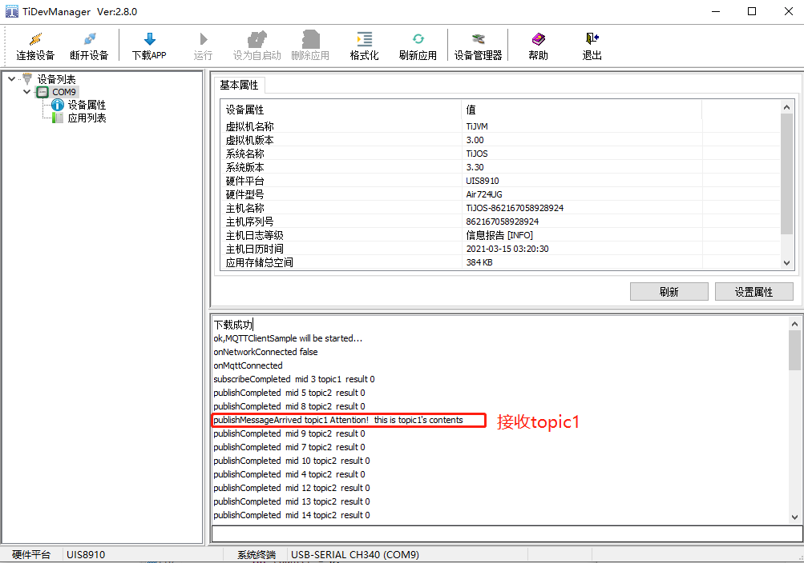
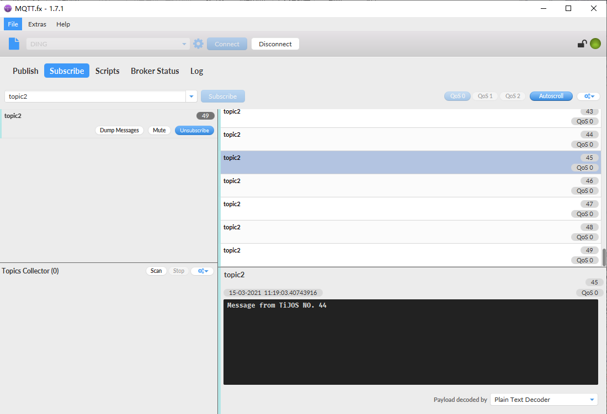

# Cat.1——MQTT的连接演示

## 简介

### MQTT

1.MQTT是一种基于`客户端-服务器`的`消息发布/订阅`模式的轻量级通讯协议，运行于TCP之上的应用层协议，提供有序、无  损、双向连接，旨在为低带宽和不稳定的网络环境中的物联网设备提供可靠的网络服务。

 请参考 https://en.wikipedia.org/wiki/MQTT 或 www.mqtt.org 了解更多信息。

2.目前主流的物联云厂商均支持MQTT， 如Amazon, 百度云，阿里云等等， TiJOS 提供符合MQTT 3.1.1标准协议的MQTT Client, 可与所有支持MQTT 协议的服务器直接连接。

 百度物联云 https://cloud.baidu.com/product/iot.html 

 阿里物联云 https://www.aliyun.com/product/iot.

### TiJOS MQTT Client 

TiJOS MQTT Client 支持TCP和SSL两种通讯方式， **符合MQTT3.1.1标准规范**，支持QOS0,1,2, 支持高性能异步API, 在处理MQTT协议过程中通过事件回调返回操作结果， 可支持突发模式"burst-mode"客户端请求， 实现快速发布无等待， 避免客户端资源等待。MQTT Client支持自动连接，默认断开连接后30秒自动重新建立连接。

### MQTT.fx

MQTT.fx目前主流的 MQTT 客户端，可以快速验证是否可以与 IoT Hub 服务交互发布或订阅消息。AWS IoT、阿里云 IoT 等云服务提供商相关产品文档教程均以 MQTT.fx 为例。


## MQTT.fx简单配置介绍

1.下载MQTT.fx

下载网址：http://mqttfx.jensd.de/index.php/download



如果您是Windows 64位系统可以下载倒数第二个



2.开始菜单打开MQTT.fx，点击设置



3.配置新建的profile

profile名称自定义;服务器地址选择test.mosquitto.org，端口号1883

连接ID不能有重复，建议”generate“;

”Gerneal“常规设置一般不做修改



4.**自定义**用户名、密码



5.连接mqtt服务器并订阅主题，执行1-4步



6.发布主题，执行1-3步

在订阅栏中相应信息中接收到发布的主题即可



## API说明

| 类名                 | 说明             |
| -------------------- | ---------------- |
| MqttConnectOptions   | Mqtt连接项设置   |
| IMqttMessageListener | Mqtt消息监听接口 |
| MqttClient           | Mqtt客户端       |


### MqttConnectOptions 类

MQTT 连接配置

| 返回值 | MqttConnectOptions                    | 说明                                                      |
| ------ | ------------------------------------- | --------------------------------------------------------- |
| void   | setCleanSession(boolean)              | 设置 Client断开连接后Server是否应该保存Client的订阅信息   |
| void   | setUserName(String)                   | 设置用户名                                                |
| void   | setPassword(String)                   | 设置密码                                                  |
| void   | setWill(String, byte[], int, boolean) | "Last Will and Testament" (LWT), 具体请参考MQTT协议       |
| void   | setKeepAliveInterval(int)             | 设置客户端与服务器之间最大空闲时间，以秒为单位，默认240秒 |


### MqttClient类

MQTT服务器地址及客户端ClientID通过MqttClient初始化时进行设置。

| 返回值 | MqttClient                                                   | 说明                                                    |
| ------ | ------------------------------------------------------------ | ------------------------------------------------------- |
| void   | connect(String clientId, String serverUrl, int timeout, MqttConnectOptions options,IMqttMessageListener listener) | 建立连接                                                |
| void   | disconnect()                                                 | 断开连接                                                |
| int    | getNetState()                                                | 获取网络状态 1 断开 2网络连接成功 3 正在连接 4 MQTT断开 |
| int    | subscribe(String topic, int qos)                             | TOPIC订阅                                               |
| int    | unsubscribe(String topic)                                    | 取消订阅                                                |
| int    | publish(String topic, byte[] payload, int qos, boolean retained) | 发布消息                                                |


## 代码实现

broker：test.mosquitto.org

username、password：随便填写

clientId：随机生成

接入设备，启动例程。设备向test.mosquitto.org服务器订阅、发布主题，在MQTT.fx中的订阅设备发布的主题、发布设备订阅的主题，并在日志中记录、打印每次发布、接收消息id。

实现步骤

1).启动LTE网络，如上初始化参数

```java
 // MQTT Server 地址,用户名, 密码
 final String broker = "mqtt://test.mosquitto.org:1883";
 final String username = "DingBao";
 final String password = "111111";
        
 // ClientID
 final String clientId = "e8ec771757eb4c8e8b42e899f1475fb9";
```

2).参考MQTT协议，使用MqttConnectOptions类配置MQTT的连接参数

```java
 MqttConnectOptions connOpts = new MqttConnectOptions();
 connOpts.setUserName(username); 
 connOpts.setPassword(password); 
```

3).创建实现类MqttEventLister实现事件监听接口*IMqttMessageListener*

4).初始化MqttClient并连接服务器

```java
MqttClient mqttClient = MqttClient.getInstance();
//连接超时10秒
int timeout = 10;
mqttClient.connect(clientId, broker, timeot, connOpts, new MqttEventLister());
```

5).MQTT  Topic 发布和订阅

```java
String topic1 = "topic1";
String topic2 = "topic2";
String content = "Message from MQTT IoT demo";
int Qos = 1;
boolean retain = false;
//订阅topic1
int msgId = mqttClient.subscribe(topic1, Qos);
//发布topic2
msgId = mqttClient.publish(topic2, content.getBytes(), Qos, retain);
```

## 运行结果

MQTT.fx操作发布topic1



Cat.1持续发布topic2，并接收到topic1



MQTT.fx持续接收来自Cat.1发布的topic2



详细代码见：

https://github.com/TiJOSteam/tijos-software-example/blob/master/src/MQTT/MQTTClientSample/src/MqttClientDemo.java

