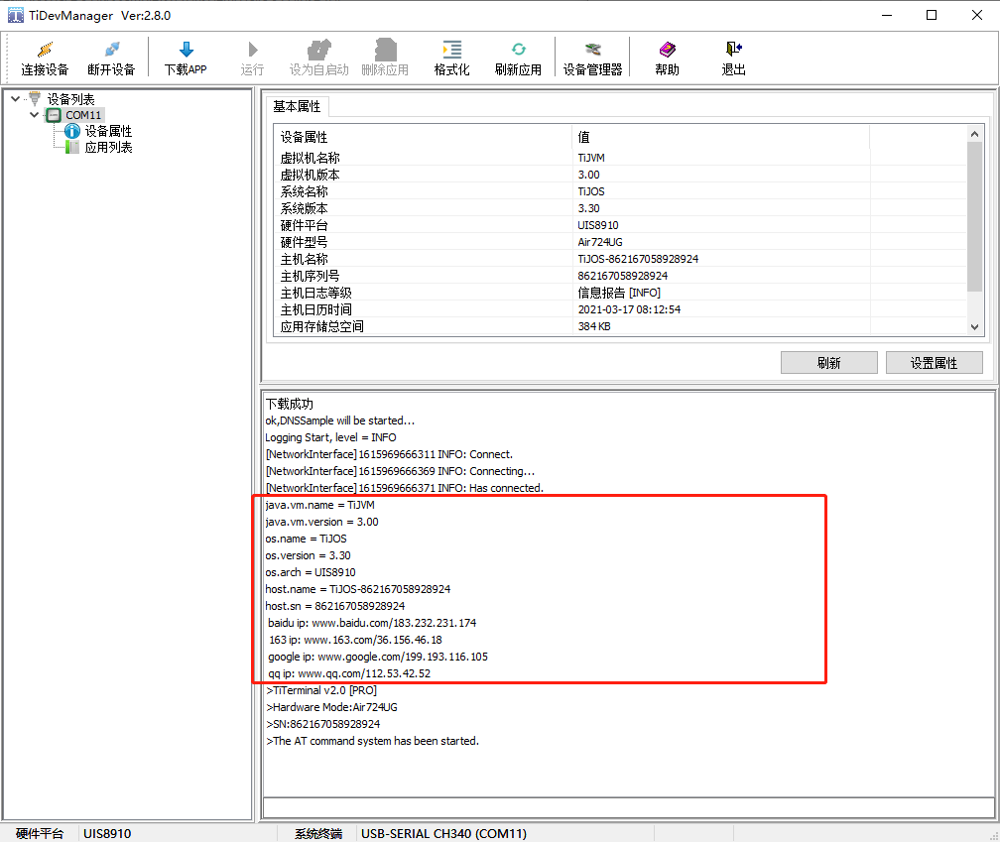

# 标准JAVA的TCP, UDP,DNS网络

## 简介

TiJOS 支持标准JAVA的TCP, UDP,DNS网络接口，标准网络应用通过java.net来支持。TiJOS 支持了大部分java.net中的类，主要包括:

| 类             | 说明                                | 网络功能   |
| -------------- | ----------------------------------- | ---------- |
| Socket         | TCP 客户端套接字                    | TCP Client |
| DatagramSocket | UDP套接字，与DatagramPacket一起使用 | UDP        |
| InetAddress    | Internet地址                        | DNS        |

其他相关类:

| 类             | 说明       | 功能                                 |
| -------------- | ---------- | ------------------------------------ |
| InputStream    | 字节输入流 | 主要用来读取以字节为单位的二进制数据 |
| OutputStream   | 字节输出流 | 主要用来写入以字节为单位的二进制数据 |
| DatagramPacket | 数据报包   | 实现无连接包投递服务                 |


## TCP

### 简介

​		TCP（Transmission Control Protocol），即传输控制协议。是一种面向连接的、可靠的、基于字节流的传输层通信协议。钛极OS(TiJOS)支持标准Java的Socket类， 编程方法与标准Java一样， 可参考相关例程， 下面以一个tcp client的例程说明如何在钛极OS(TiJOS)中通过TCP连接网络中的服务器。

客户端操作：

1、建立连接:使用Socket创建客户端+服务的地址和端口

2、操作：输入输出流操作

3、释放资源

### 示例

此例子演示RS485与服务器的通信：

1.启动网络，打开RS485并获取TiRS485对象

```java
// 启动LTE网络
TiLTE.getInstance().startup(20);
// 获取TiGW200对象并启动看门狗
TiGW200 gw200 = TiGW200.getInstance();
// 获取第0路RS485 9600 8 1 N
TiSerialPort rs485 = gw200.getRS485(9600, 8, 1, TiUART.PARITY_NONE);
```

2.创建Socket连接服务器（指定ip地址，端口号）

```java
//创建Socket连接服务器（指定ip地址，端口号）
Socket client = new Socket("tcp.ticloud.io", 9876);
```

3.接收网络数据并将数据下发到485

```java
//创建缓存数组
int len = 0;
byte[] data = new byte[1024];

//获取服务连接的网络输入流
IutputStream is = client.getIutputStream();

//读取输入流中的数据，并将数据写进485
while((len = is.read(data, 0, data.length)) != 0){
    rs485.write(data, 0, len);
}
```

4.读取485发送网络数据

```java
//获取服务连接的网络输出流
OutputStream os = client.getOutputStream();
//读取485数据
byte[] receive = rs485.read(1000);
//将数据写入到输出流
os.write(recieve);
```

5.关闭网络资源

```java
client.close();
```

注意：上传数据时的阻塞问题

以上即为在钛极OS(TiJOS)中进行网络编程的一般流程，与标准Java类似， 不同的是需要在使用网络前需要启动相应的网络连接。

## UDP

### 简介

​		UDP 协议将数据、源、目的封装成数据包，无需建立连接。虽然 UDP 协议是一种不太可靠的协议，但有时在需要较快地接收数据并且可以忍受较小错误的情况下，UDP 就会表现出更大的优势。

使用 UDP 协议发送数据步骤：

​		1.使用 DatagramSocket() 创建一个数据包套接字。

​		2.使用 DatagramPacket() 创建要发送的数据包。

​		3.使用 DatagramSocket 类的 send() 方法发送数据包。

**DatagramPacket**

实例化：

`DatagramPacket(byte[] buf,int length,InetAddress address,int port)——用来将长度为 length 的包发送到指定主机上的指定端口。`

常用方法：

`void setData(byte[] buf)——为此包设置数据缓冲区。`

`void setAddress(InetAddress addr)——设置要将此数据报发往的目的机器的IP地址。`

### 示例

1.启动LTE网络，创建DatagramSocket实例

```java
//启动LTE 网络
TiLTE.getInstance().startup(10);
//构造数据报包套接字
DatagramSocket udpSocket = new DatagramSocket();
```

2.发送数据

```java
//初始化发送数据、地址、端口
String host = "www.baidu.com";
int port = 81;
byte[] msg = ("Hello Server").getBytes();

//创建发送数据包，绑定发送的数据、地址、端口
DatagramPacket dp = new DatagramPacket(msg, msg.length, InetAddress.getByName(host), port);

//客户端发送数据
udpSocket.send(dp);
```

3.接收数据

```java
//接收数据包
byte[] buffer = new byte[1024];
dp.setData(buffer);
dp.setAddress(null);

//客户端接收数据，默认超时时间10s
udpSocket.receive(dp);
```

4.释放网络资源

```java
//关闭此数据报包套接字
udpSocket.close();
```

## DNS

### 简介

​		DNS( Domain Name System)服务——域名解析服务，用于TCP/IP网络，能够提供域名与IP地址的解析服务。提供ip地址和域名之间的映射关系，这样我们在访问www.baidu.com的时候DNS就知道它的ip地址

**InetAddress类——此类的一个对象就代表着一个具体的IP地址**

实例化：

`getByName(String host)`

### 示例

本例程演示如何获取系统信息以及通过java标准InetAddress访问TiJOS的DNS服务，获取指定域名IP地址

```java
//启动LTE网络
TiLTE.getInstance().startup(10);

//使用System类中的getProperty(String key)方法获取当前系统的属性

System.out.println("java.vm.name = " + System.getProperty("java.vm.name"));
System.out.println("java.vm.version="+System.getProperty("java.vm.version"));

System.out.println("os.name = " + System.getProperty("os.name"));
System.out.println("os.version = " + System.getProperty("os.version"));
System.out.println("os.arch = " + System.getProperty("os.arch"));

System.out.println("host.name = " + System.getProperty("host.name"));
System.out.println("host.sn = " + System.getProperty("host.sn"));

//访问DNS服务，获取域名ip地址

System.out.println(" baidu ip: " + InetAddress.getByName("www.baidu.com"));
System.out.println(" 163 ip: " + InetAddress.getByName("www.163.com"));
System.out.println(" google ip: " + InetAddress.getByName("www.google.com"));
System.out.println(" qq ip: " + InetAddress.getByName("www.qq.com"));
```

打印的结果

