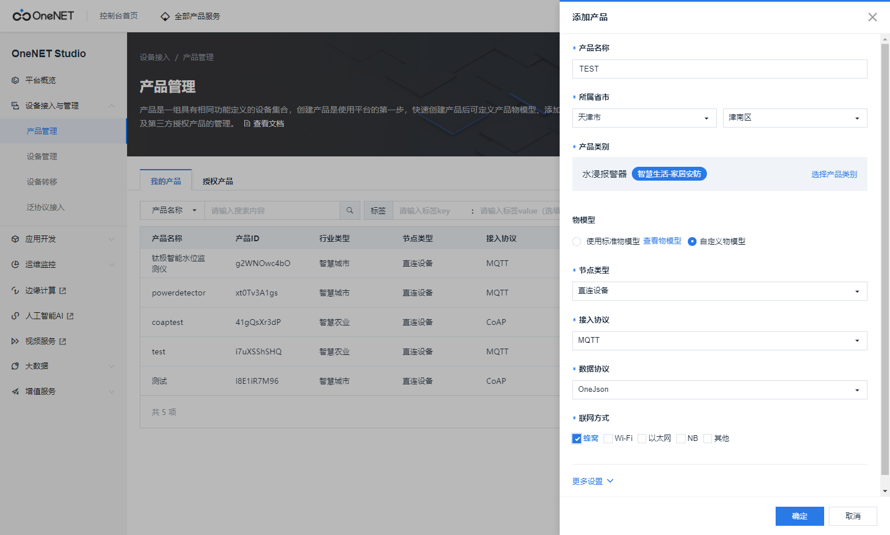
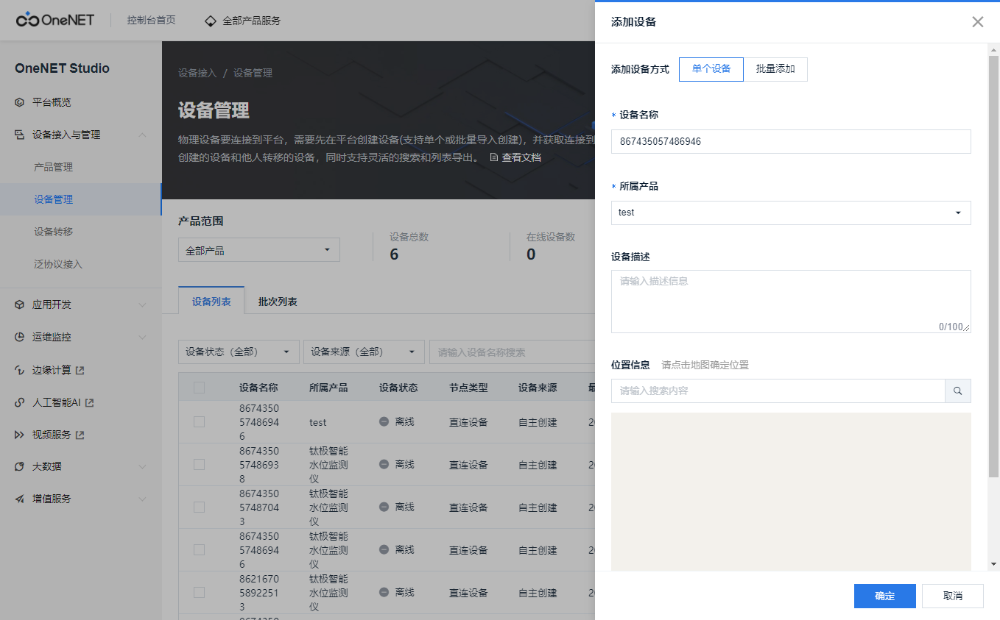
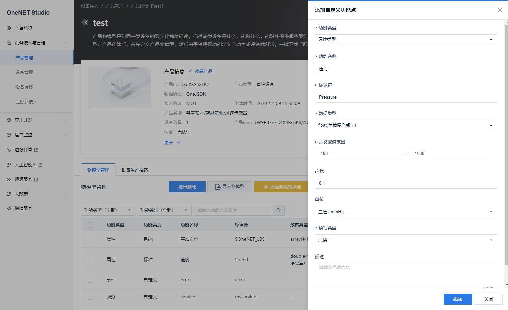

# 中国移动OneNET Studio物联网平台客户端

OneNET Studio 是新一代物联网中台，向下接入设备，向上承载应用，为用户提供一站式“终端-平台-应用”整体解决方案，帮助企业实现海量设备的快速上云。设备侧提供物联网设备接入、设备管理、数据解析、数据转发、设备运维监控等服务；应用侧提供丰富的API接口、数据推送、消息队列、规则引擎场景联动等功能；同时提供语音通话、LBS定位、数据分析及可视化等增值服务。 详情请参考https://open.iot.10086.cn/studio/summary

OneNET Studio支持多种方式接入，包括MQTT, CoAP, LWM2M等， 钛极OS(TiJOS)对MQTT进行了封装方便用户使用， CoAP和LWM2M用户基于标准CoAP,LWM2M接口使用即可。

## Java包

tijos.framework.networkcenter.onenet、

### OneNET Studio MQTT客户端 - OneNetMqttClient类

OneNetMqttClient类中包含了OnetNET MQTT客户端相关的操作，支持OneNET提供的各种设备能力， 包括物模型、基站定位能力等等。 OneNET通过属性、事件、服务构成的物模型描述设备，在设备接入前需要先在OneNET平台中建立相应的产品、物模型，以及对应的设备等等信息， 并获得产品和设备的名称及认证信息， 具体请参考相关的帮助文档。

| 方法                                                         | 说明                                                        |
| :----------------------------------------------------------- | :---------------------------------------------------------- |
| OneNetMqttClient(String productId, String deviceName, String accessKey) | 构造函数， 参数分别为：产品ID，设备名称及设备密钥或产品密钥 |
| void connect(IOneNetEventListener listener)                  | 启动并连接物联网平台                                        |
| void disconnect()                                            | 断开连接并释放                                              |

注： accessKey可以使用产品密钥，也可使用设备密钥， 为方便管理可使用产品密钥

物模型相关方法

| 方法                                                         | 说明                                                         |
| :----------------------------------------------------------- | :----------------------------------------------------------- |
| String propertyReport(JSONObject property)                   | 设备属性上报， params为属性和值的JSON格式数据                |
| String eventReport(String eventId, JSONObject params)        | 设备事件上报 eventId -事件ID params对应的JSON格式属性值      |
| void lbsCellLocationReport()                                 | 基于基站的设备位置信息上报 仅适用于4G系列产品                |
| void propertySetReply(String msgId, int code, String msg)    | 对于云端属性控制onPropertySetArrived指令回复，code=200成功   |
| void serviceInvokeReply(String msgId, String serviceId, int code, String message, JSONObject respParams) | 对于云端异步服务调用onServiceInvokeArrived指令回复，code=200成功 |

### IOneNetMqttEventListener物模型事件监听

IOneNetMqttEventListener提供了数据模型相关事件处理接口， 不应在事件中进行长时间的处理从而阻塞其它事件

| 方法                                                         | 说明                 |
| ------------------------------------------------------------ | -------------------- |
| void onPropertyReportReply(String msgId, int code, String message) | 属性上报云端回复     |
| void onEventReportReply(String msgId, int code, String message) | 事件上报云端回复     |
| void onPropertySetArrived(String msgId, JSONObject params)   | 收到云端属性控制指令 |
| void onServiceInvokeArrived(String msgId, String serviceId, JSONObject params) | 收到云端服务调用事件 |

## 使用说明

在开发之间请先在平台上建立相应的产品及物模型

OneNET Studio网址：https://open.iot.10086.cn/studio/device/productManage/

开发说明文档：https://open.iot.10086.cn/doc/iot_platform/book/device-connect&manager/product-create.html

产品管理——>添加产品



设备管理——>添加设备



设置物模型——>添加自定义功能点




```java
//产品id
String productId = "i7uXSShSHQ";
//设备名称建议与模组IMEI关联
String deviceName = "867435057486946";
//设备密钥或产品密钥
String accessKey = "//vl4/m7HRehDSt/QfW7x63RZZtvh+PpayOZBZUxf3k=";

// 启动并连接云平台
OneNetMqttClient onenet = new OneNetMqttClient(productId, deviceName, accessKey);
onenet.connect(new OnenetMqttEventListner());


// 物模型中的属性上报

//使用JSONObject编辑属性
JSONObject speed = new JSONObject();
JSONObject properties = new JSONObject();
//时间戳time UTC时间
properties.put("Speed", speed.put("value", 10.0).put("time", TimeZone.currentUTCTimeSeconds()));
//上报属性
onenet.propertyReport(properties);

```

```java
//使用方法编辑属性
OneJSONProperty property = new OneJSONProperty();
property.setProperty("Speed", TimeZone.currentUTCTimeSeconds(), 10);
onenet.propertyReport(property.toJSON());
```

```java 
// 物模型中的事件上报
JSONObject eventValue = new JSONObject();
eventValue.put("code", 10);

JSONObject paramId = new JSONObject();
paramId.put("value", eventValue).put("time", TimeZone.currentUTCTimeSeconds());
onenet.eventReport("error",paramId);
```

事件回调，物模型相关事件通过OneNetMqttEventListener事件监听器回调进行处理

```java
class OnenetEventListner implements IOneNetMqttEventListener {

	OneNetMqttClient onenet;
	
	public OnenetEventListner(OneNetMqttClient onenet)
	{
		this.onenet = onenet;
	}
	
	@Override
	public void onMqttConnected() {
		// TODO Auto-generated method stub
		System.out.println("onMqttConnected ");

	}

	@Override
	public void onMqttDisconnected(int error) {
		System.out.println("onMqttDisconnected " + error);

	}

	@Override
	public void onPropertyReportReply(String msgId, int code, String message) {
		System.out.println("onPropertyReportReply " + msgId + " " + code + " " + message);

	}

	@Override
	public void onEventReportReply(String msgId, int code, String message) {
		System.out.println("onEventReportReply " + msgId + " " + code + " " + message);

	}

	@Override
	public void onPropertySetArrived(String msgId, JSONObject params) {
		System.out.println("msgId " + msgId + " " + params.toString());

		try {
			onenet.propertySetReply(msgId, 200, "OK");
		} catch (IOException e) {
			// TODO Auto-generated catch block
			e.printStackTrace();
		}
		
	}

	@Override
	public void onServiceInvokeArrived(String msgId, String serviceId, JSONObject params) {
		System.out.println("onServiceInvokeArrived " + "msgId " + msgId + " serviceId " + serviceId + " "
				+ params.toString());

		JSONObject response = new JSONObject();

		try {
			onenet.serviceInvokeReply(msgId, serviceId, 200, "OK", response);
		} catch (IOException e) {
			e.printStackTrace();
		}
	}

	@Override
	public void onDesiredDeleteReply(String arg0, int arg1, String arg2) {
		// TODO Auto-generated method stub
		
	}

	@Override
	public void onDesiredPropertySetArrived(String arg0, JSONObject arg1) {
		// TODO Auto-generated method stub
		
	}

	@Override
	public void onPropertyGetArrived(String arg0, String[] arg1) {
		// TODO Auto-generated method stub
		
	}

}

```