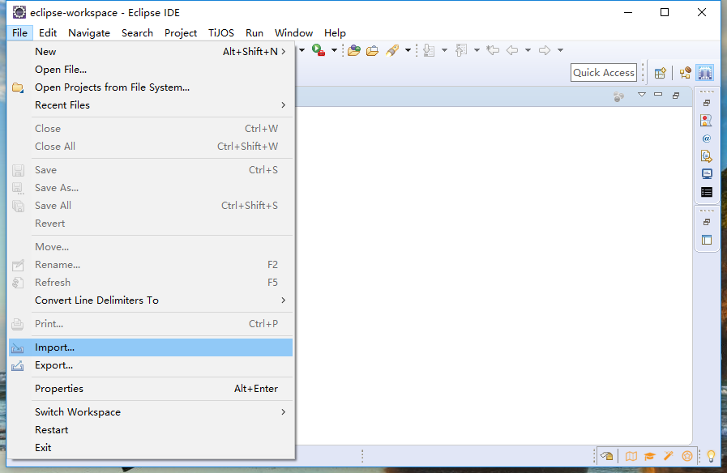

# 开启TiJOS之旅—设备初体验 #

## 温馨提示 ##
- 请先确定开发环境已经安好，如有问题请见上节课程搭建开发环境。

- 测试例程能把TIGW200部分外设、联网功能实现。

- 通过在TiGW200上运行测试例程，基本能确定设备是否完好。如有问题，请及时与客服联系。

- modbus-rtu工程中包含两个基本实例：

  LTENetworkSample案例能实现开发板的联网功能；需插4G卡
  
  modbusSample案例能实现外接RS485温湿度计的读取数据操作；需要外接RS485传感器。

## 产品体验 ##

### 导入测试例程

**1.打开Eclipse，点击File,选Import单击。**



**2.选择General目录下“Existing Projects into Workspace”,点击Next。**


**3.点击Browse。**


**4.选择测试工程modbus-rtu,点击选择文件。**


**5.点击Finish。**


**6.如下图所示，您已导入成功。**


### 连接设备

**7.点TiJOS图标，弹出TiDevManger窗口。****

 

**8.点击连接设备。**


**9.连接设备**


​       注：①用户若无4G物联网卡，可使用手机4G手机卡代替；

​			   ②若无天线可不连接，但会影响注网；

​			   ③若无电源线，USB可供电；

**10.系统终端选择USB-SERIAL CH340（COM？）点击确定。**


**11.如下图所示，您已成功连接设备。**


### 运行例程

#### **13—(1) ：运行LTENetworkSample.java例程**

右键单击LTENetworkSample例程—>Run As—>TiJOS Application


如下图所示，测试例程已在设备里成功运行。


#### 13—(2) ：运行modbusSample.java例程

根据传感器连接不同通道（0、1）更改getRS485()方法的参数

```java
   // 获取第1路RS485  波特率：9600  数据位8  停止位1  N
	  TiRS485 rs485 = gw200.getRS485(0, 9600, TiUART.PARITY_NONE);
```

根据不同传感器需修改设备地址、开始地址、读取个数

```java
      // MODBUS device id 设备地址
	  int deviceId = 1;
	  // Input Register 开始地址
	  int startAddr = 0;

	  // Read 2 registers from start address 读取个数
	  int count = 2;

	  // 读取Holding Register
	  modbusRtu.initReadHoldingsRequest(deviceId, startAddr, count);
```

右键单击modbusSample例程—>Run As—>TiJOS Application


也可在TiDeviceManager查看设备运行日志


注：设备默认为开发状态，可直接连接设备；

​        若用户将开发后的应用设置为自启动则需在连接设备前做如下操作则可再次进入开发状态

​        1.按住功能键；2.重新插拔电源；3.松开功能键

