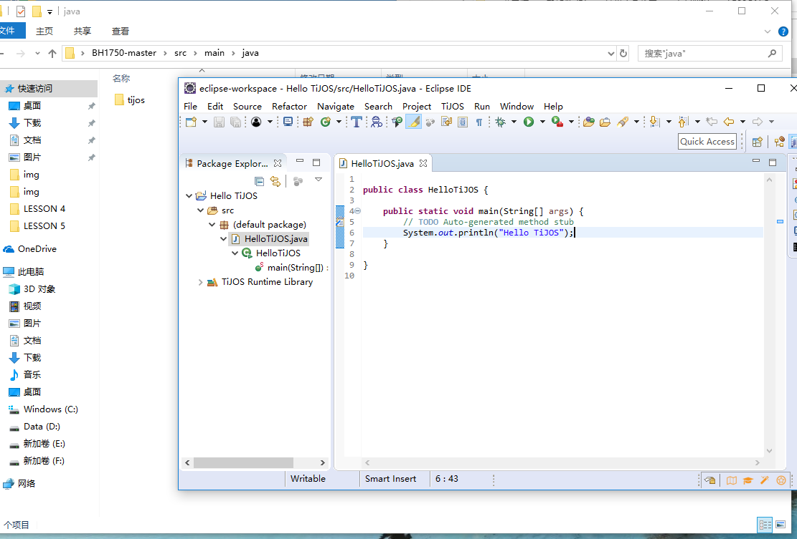
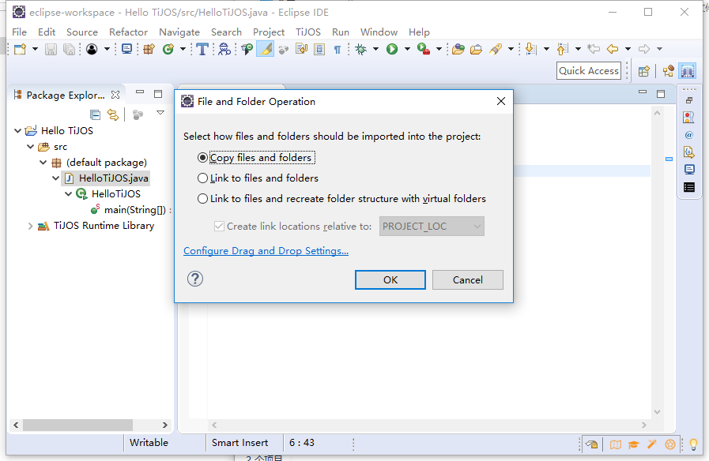

# 傻瓜式操作—快捷应用 #

## 温馨提示 ##

- 和读者分享一下Eclipse的快捷操作，使用小技巧，快速高效开发离不开软件的操作技巧。

## 一、Eclipse使用小技巧 ##

　　**Eclipse** 是一个开放源代码的、基于Java的可扩展开发平台。就其本身而言，它只是一个框架和一组服务，用于通过插件组件构建开发环境。    
　　详细介绍链接如下：        
**https://baike.baidu.com/item/Eclipse/61703**  
　　使用技巧链接如下：             
**https://blog.csdn.net/tiantangdizhibuxiang/article/details/77256430**                                                         
**https://www.cnblogs.com/ning123/p/5954589.html**

## 一、工程移植 ##

　　下载下来的库文件都是完整的工程，可以直接导入运行，导入详细过程在前面已经讲解过。

　　驱动包可以直接用鼠标拖入工程。

　　弹出如下对话框，点击OK。

　　驱动包已成功导入工程。

## 二、程序纠正 ##

　　驱动的导入后，程序可以直接写，不用考虑少驱动文件。出现错误不用担心，把光标拖到错误出会弹出改正方法。

　　点加入头文件，如下图，其他错误同理。

　　软件自动更正错误。

