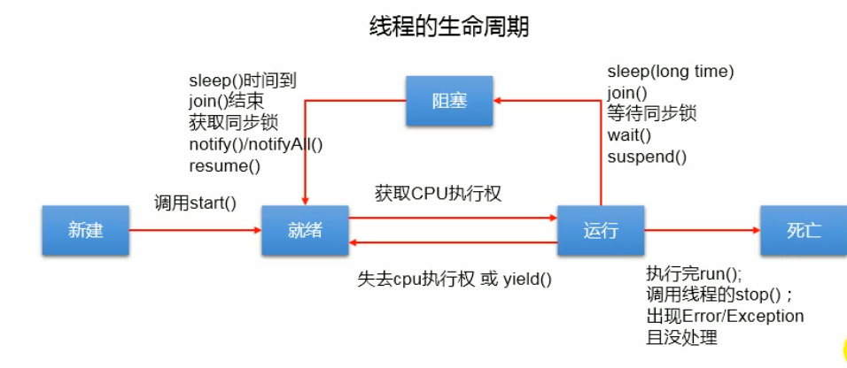

#  生产者与消费者-钛极OS系统中的多线程

## 简介

钛极OS(TiJOS)支持Java中标准的线程Thread和Runnable, **符合Java标准**，线程可以大大简化许多类型的应用程序开发，但过度使用线程可能会影响程序的性能及其可维护性， 一般建议用在不阻塞整个程序的情况下执行阻塞I/O, 如等待网络数据等等

钛极OS(TiJOS)中的线程**与Java标准兼容**， 因此只需参考Java中Thread 和Runnable类编程方式即可快速应用。

## 线程的生命周期




- 新建：就是刚使用new方法，new出来的线程；
- 就绪：调用start()方法后，线程处于等待CPU分配资源阶段，谁先抢的CPU资源，谁开始执行;
- 运行：当就绪的线程被调度并获得CPU资源时，便进入运行状态，run方法定义了线程的操作和功能;
- 阻塞：在运行状态的时候，可能因为某些原因导致运行状态的线程变成了阻塞状态，比如sleep()、wait()之后线程就处于了阻塞状态，这个时候需要其他机制将处于阻塞状态的线程唤醒，比如调用notify或者notifyAll()方法。唤醒的线程不会立刻执行run方法，它们要再次等待CPU分配资源进入运行状态;
- 销毁：如果线程正常执行完毕后或线程被提前强制性的终止或出现异常导致结束，那么线程就要被销毁，释放资源;

## API说明

**Thread类**

构造方法

| 构造方法                                   | 说明                                       |
| ------------------------------------------ | ------------------------------------------ |
| public Thread()                            | 分配一个新的新的线程对象                   |
| public Thread(String name)                 | 分配一个指定名字的新的线程对象             |
| public Thread(Runnable target)             | 分配一个带有指定目标新的线程对象           |
| public Thread(Runnable target,String name) | 分配一个带有制定目标、指定名字新的线程对象 |

常用方法

| 返回值        | 常用方法           | 说明                                                 |
| ------------- | ------------------ | ---------------------------------------------------- |
| String        | getname()          | 获取当前线程名称                                     |
| void          | start()            | 导致此线程开始执行，java虚拟机调用此线程的run方法    |
| void          | run()              | 此线程要执行的任务在此处定义代码                     |
| static void   | sleep(long millis) | 使当前正在执行的线程以指定毫秒数暂停（暂时停止执行） |
| static Thread | currentThread()    | 返回当前正在执行的线程对象的引用                     |

 

## 线程安全

1.使用synchronized关键字（可修饰代码块或方法）

​	(1) 同步代码块

```java
//将同步代码块锁住，只允许一个线程执行同步代码块

synchronized(同步锁对象){
    //需要同步操作的代码块
}
```

注：同步代码块中的锁对象可以用任意对象，但必须保证多个线程使用的锁对象是同一个。

​	(2) 同步方法

```java
public synchronized void method(){
    //可能会产生线程安全问题的代码
}


public static synchronized void method(){
	//可能会产生线程安全问题的代码
}


```

同步锁： 对于非static方法，同步锁是this；

​				 对于static方法，同步锁是当前方法所在类的字节码对象(.class)

2.使用LOCK锁

```java
ReentrantLock lock = new ReentrantLock()；
//对对操作共享数据的代码进行加锁
lock.lock();  

//可能会产生线程安全问题的代码

lock.unlock(); //进行解锁
```

## 处理方式

在Java中生产者与消费者的处理方式一般遵循如下原则:

|       | 生产者与消费者模型             | Java中的解决方法                                             |
| ----- | ------------------------------ | ------------------------------------------------------------ |
| 条件1 | 同一时间内只能有一个生产者生产 | 生产方法加锁sychronized                                      |
| 条件2 | 同一时间内只能有一个消费者消费 | 消费方法加锁sychronized                                      |
| 条件3 | 生产者生产的同时消费者不能消费 | 生产方法加锁sychronized                                      |
| 条件4 | 消费者消费的同时生产者不能生产 | 消费方法加锁sychronized                                      |
| 条件5 | 共享空间空时消费者不能继续消费 | 消费前循环判断是否为空，空的话将该线程wait，释放锁允许其他同步方法执行 |
| 条件6 | 共享空间满时生产者不能继续生产 | 生产前循环判断是否为满，满的话将该线程wait，释放锁允许其他同步方法执行 |

## 例子

使用LinkedList<Object> ，作为生产者仓库

详细代码：https://github.com/TiJOSteam/tijos-software-example/tree/master/src/thread/ThreadSample