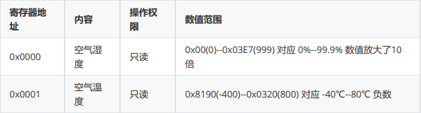

# RS485读写数据

## 简介

​		RS485使用该标准的数字通信网络能在远距离条件下以及电子噪声大的环境下有效传输信号。RS485接口使用半双工传输技术，采用屏蔽双绞线传输，总线式拓扑结构在同一总线上可以挂接32个结点。本Cat.1产品拥有2路RS485，可挂接64个结点。

​		注意：在编码中通过`getRS485`方法获取串口后，即可对串口进行读写操作。主、从机的波特率、数据位、停止位、校验位需保持一致。

## 标准RS485协议读写数据

### API

#### TiGW200类

没有提供公共构造器，通过静态方法获得单例

| 返回值         | TiGW200常用方法                                              | 说明                                           |
| -------------- | ------------------------------------------------------------ | ---------------------------------------------- |
| static TiGW200 | getInstance()                                                | 获取TiGW200对象并启动看门狗                    |
| TiSerialPort   | getRS485(int baudRate, int dataBitNum, int stopBitNum, int parity) | 获取通道0 RS485端口                            |
| TiSerialPort   | getRS485ById(int id, int baudRate, int dataBitNum, int stopBitNum, int parity) | 获取指定通道RS485端口，多通道485时请使用此接口 |
| TiLED          | blueLED()                                                    | 获取id=0 TiLED蓝灯对象                         |
| TiLED          | greenLED()                                                   | 获取id=1 TiLED绿灯对象                         |

参数说明

| 参数       | 说明                                            |
| ---------- | ----------------------------------------------- |
| id         | 通道0、通道1                                    |
| baudRate   | 波特率                                          |
| dataBitNum | 数据位      8                                   |
| stopBitNum | 停止位      1                                   |
| parity     | 校验位      0 - 无校验  1 - 奇校验   2 - 偶校验 |

（数据位，停止位固定为8,1)

#### TiRS485串口类

//通过getRS485获取串口后，即可对串口进行读写操作

| 构造方法                          | 说明                                       |
| --------------------------------- | ------------------------------------------ |
| public TiSerialPort(int uartPort) | 通过指定port初始化TiUART对象——打开指定UART |

| 返回值        | TiSerialPort常用方法                        | 说明                                 |
| ------------- | ------------------------------------------- | ------------------------------------ |
| public void   | write(byte[] buffer, int start, int length) | 向串口写入数据                       |
| public byte[] | read()                                      | 从串口读取数据                       |
| public byte[] | read(int msec)                              | 从串口读取数据；msec为最大超时毫秒值 |

### 代码实现

1. 获取第1路RS485

```java
TiSerialPort rs485 = TiGW200.getInstance().getRS485(9600, 8, 1, TiUART.PARITY_NONE);
```

2. 读、写RS485数据

    2-1  读、写16进制数据

```java
byte[] outputHex = { 0x01, 0x02, 0x03, 0x04, 0x05, 0x06, 0x07, 0x08 };

// 下发数据
rs485.write(outputHex, 0, outputHex.length);

// 读取数据 最大超时时间为2s
byte[] receive = rs485.read(2000);
```

​		2-2  读、写字符串数据

```java
byte[] data = "this is a text".getBytes();

// 下发数据
rs485.write(data, 0, data.lesngth);

// 读取数据
receive = rs485.read(2000);
// 转换成字符串
String rec = new String(receive);
```


## Modbus

在串行链路上、主从设备通信中，Modbus协议有两种传输模式——ASCII模式和RTU模式

建议相关开发人员在所需要传输的数据量较小可以考虑使用ASCII协议，如果所需传输的数据量比较大，最好使用RTU协议。

下面将分别介绍如何通过这两种协议读写数据：

## ModbusRTU协议读写数据

请参考文档：《TiGW200可编程4G数传控制器开发指南.pdf》

功能码介绍参考：https://www.jianshu.com/p/0f44d3b659e8

根据ModbusRTU协议，常规485通讯的信息发送形式如下：

| 地址  | 功能码 | 数据信息 | 校验码 |
| ----- | ------ | -------- | ------ |
| 1byte | 1byte  | nbyte    | 2byte  |

### 四种寄存器功能简介

**线圈寄存器：**实际上就可以类比为开关量（继电器状态），每一个bit对应一个信号的开关状态，即一个byte就可以同时控制8路的信号，支持`读写`。——01H 05H 0FH

**离散输入寄存器：**相当于线圈寄存器的`只读`模式。——02H

**保持寄存器（通常使用）：**单位是两个byte，可以存放具体的数据量，支持`读写`，一般对应参数设置。——03H 06H 10H

**输入寄存器：**这个和保持寄存器类似，`只读`，一般是读取各种实时数据。一个寄存器也是占据两个byte的空间。——04H

### API说明

**构造器**

| ModbusRTU构造方法                                      | 说明                                                       |
| ------------------------------------------------------ | ---------------------------------------------------------- |
| public ModbusRTU(TiSerialPort serialPort)              | serialPort: RS485通讯对象，默认延迟2000ms                  |
| public ModbusRTU(TiSerialPort serialPort, int timeout) | serialPort: RS485通讯对象， timeout: RS485设备通讯超时时间 |

**初始化寄存器请求的方法**

| 对应功能码 | 初始化寄存器请求                                             | 说明                       | 操作数量 |
| ---------- | ------------------------------------------------------------ | -------------------------- | -------- |
| 01H        | initReadCoilsRequest(int deviceId, int startAddress, int count) | 初始化读线圈寄存器请求     | 单/多    |
| 02H        | initReadDInputsRequest(int deviceId, int startAddress, int count) | 初始化读离散输入寄存器请求 | 单/多    |
| 03H        | initReadHoldingsRequest(int deviceId, int startAddress, int count) | 初始化读保持寄存器请求     | 单/多    |
| 04H        | initReadAInputsRequest(int deviceId, int startAddress, int count) | 初始化读输入寄存器请求     | 单/多    |
| 05H        | initWriteCoilRequest(int deviceId, int coilAddress, boolean value) | 初始化写单个线圈寄存器请求 | 单个     |
| 06H        | initWriteRegisterRequest(int deviceId, int regAddress, int value) | 初始化写单个保持寄存器请求 | 单个     |
| 0FH        | initWriteCoilsRequest(int deviceId, int startAddress, boolean[] values) | 初始化写多个线圈寄存器请求 | 多个     |
| 10H        | initWriteRegistersRequest(int deviceId, int startAddress, int[] values) | 初始化写多个保持寄存器请求 | 多个     |

**执行获取数值的方法**

| 返回值  | 执行请求                                         | 说明                                                         |
| ------- | ------------------------------------------------ | ------------------------------------------------------------ |
| int     | execRequest()                                    | 执行MODBUS 请求并获得MODBUS响应结果                          |
| int     | getResponseAddress()                             | 获取返回的MODBUS寄存器开始地址                               |
| int     | getResponseCount()                               | 获取返回的MODBUS寄存器个数                                   |
| boolean | getResponseBit(int address)                      | 获取指定地址COIL寄存器值， 对应于 InitReadCoilsRequest/InitReadDInputsRequest |
| int     | getResponseInt16(int address, boolean unsigned)  | 获取指定地址InputRegister/HoldingRegister的值， unsigned: 返回值 为无符号或有符号整数 |
| int     | getResponseInt32(int address, boolean bigEndian) | 获取指定地址InputRegister/HoldingRegister的连续2个寄 存器值组成1个32位有符号整数， bigEndian:是否为大端格式 |
| float   | getResponseFloat(int address, boolean bigEndian) | 获取指定地址InputRegister/HoldingRegister的连续2个寄 存器值组成1个32位浮点数， bigEndian:是否为大端格式 |

**参数说明**

| 参数         | 说明                  |
| ------------ | --------------------- |
| deviceId     | MODBUS设备地址        |
| startAddress | MODBUS 寄存器开始地址 |
| count        | 寄存器个数            |
| regAddress   | MODBUS 寄存器地址     |

### 操作步骤

MODBUS 组件的调用过程一般为： 

1. 指定串口实例化MODBUS对象，ModbusClient(TiRS485 serialPort, int timeout) 
2. 初始化MODBUS寄存器读写操作请求， initXXXRequest
3.  执行MODBUS请求并返回结果 execRequest 
4. 根据设备协议中定义的数据类型获取返回的寄存器值 getResponseBit/getResponseInt16/getResponseInt32/getResponseFloat

### 例程

设备通讯参数


**寄存器**： INPUT REGISTER (03)



**代码调用过程**

1. 打开RS485并获取TiRS485对象

```java
TiGW200 gw200 = TiGW200.getInstance();
//获取RS485通道1
TiRS485 rs485 = gw200.getRS485(0, 9600, TiUART.PARITY_NONE);
```

2. 创建MODBUS协议对象并挂接RS485

```java
//通讯超时2000 ms
ModbusRTU modbusRtu = new ModbusRTU(rs485, 2000);
```

3. 通过MODBUS协议读取寄存器数据

```java
// MODBUS device address 设备地址
int deviceId = 1;
// Input Register 寄存器开始地址
int startAddr = 0;
// Read 2 registers from start address 读取个数
int count = 2;
//初始读取Holding Register参数， 设备地址， 寄存器开始地址， 个数
modbusRtu.initReadHoldingsRequest(deviceId, startAddr, count);
int result = modbusRtu.execRequest();
//读取成功进行数据解析
if (result == ModbusClient.RESULT_OK) {
//获取第1个寄存器值 - 温度
int temperature = modbusRtu.getResponseInt16(startAddr, false);
//获取第2个寄存器值 - 湿度
int humdity = modbusRtu.getResponseInt16(startAddr + 1, false);
}
```

## ModbusASCⅡ协议读取数据

根据ModbusRTU协议，常规485通讯的信息发送形式如下：

| 开始        | 从机地址 | 功能码  | 数据信息 | 校验码  | 结束           |
| ----------- | -------- | ------- | -------- | ------- | -------------- |
| 1个字符  ： | 2个字符  | 2个字符 | 2n个字符 | 2个字符 | 2个字符  CR/LF |

ModbusASCII类的初始化寄存器请求方法、执行获取数值同上（与ModbusRTU类的方法一致）

### 操作步骤

MODBUS 组件的调用过程一般为： 

1. 指定串口实例化ModbusASCII对象，ModbusASCII(TiRS485 serialPort, int timeout) 
2. 初始化MODBUS寄存器读写操作请求， initXXXRequest
3. 执行MODBUS请求并返回结果 execRequest 
4. 根据设备协议中定义的数据类型获取返回的寄存器值 getResponseBit/getResponseInt16/getResponseInt32/getResponseFloat

### 例程

1. 打开RS485并获取TiRS485对象

```java
//.....同上...
```

1. 创建MODBUS协议对象并挂接RS485

```java
//通讯超时2000 ms
ModbusASCII modbusAsc = new ModbusASCII(rs485, 2000);
```

1. 通过MODBUS协议读取寄存器数据

```java
//.....同上...
```

